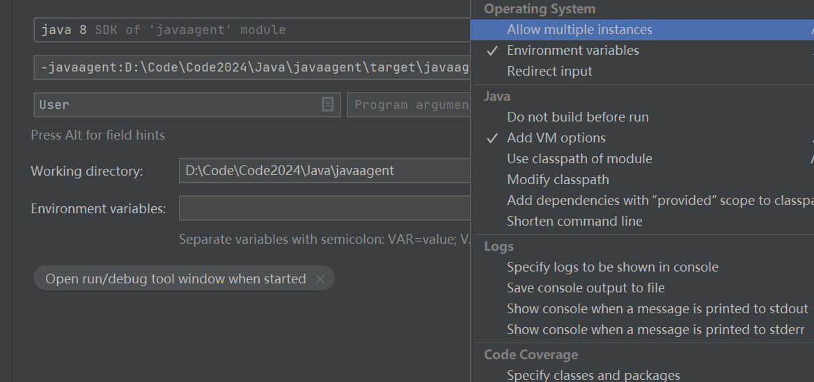

## Java agent

Bytecode Manipulation

add in vm option



java -javaagent:.\agent\java-agent-learning-1.0-SNAPSHOT.jar agent.Test

java (vm option)   file   (program argument)

### Javaagent

```java
public static void premain(String agentArgs, Instrumentation inst)
```

```java
class MyTransformer implements ClassFileTransformer {

    @Override
    public byte[] transform(ClassLoader loader, String className, Class<?> classBeingRedefined, ProtectionDomain protectionDomain, byte[] classfileBuffer) {
    
    }
```

```java
pre_call
$_ = $proceed($$);
post_call
```

### ByteBuddy

### Monitoring JVM and GC Status

`java.lang.management` is a package in the Java Standard Edition (SE) API that provides management and monitoring of the Java Virtual Machine (JVM). It contains interfaces and classes that allow you to obtain information about the JVM's memory usage, garbage collection, thread utilization, class loading, and more.

```java
static void printMemoryInfo() {
    MemoryMXBean memory = ManagementFactory.getMemoryMXBean();
    // heap memory, which includes areas like the young and old generation.
    MemoryUsage headMemory = memory.getHeapMemoryUsage();

    String info = String.format("\ninit: %s\t max: %s\t used: %s\t committed: %s\t use rate: %s\n",
            headMemory.getInit() / MB + "MB",
            headMemory.getMax() / MB + "MB", headMemory.getUsed() / MB + "MB",
            headMemory.getCommitted() / MB + "MB",
            headMemory.getUsed() * 100 / headMemory.getCommitted() + "%"

    );
}
```

max > commit > used

TODO

* 线程池
* ThreadLocal
* JVM 
* 字节码